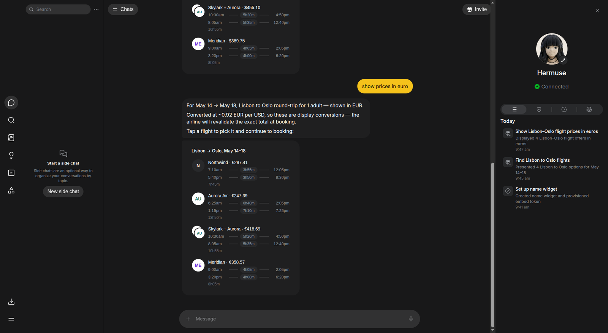
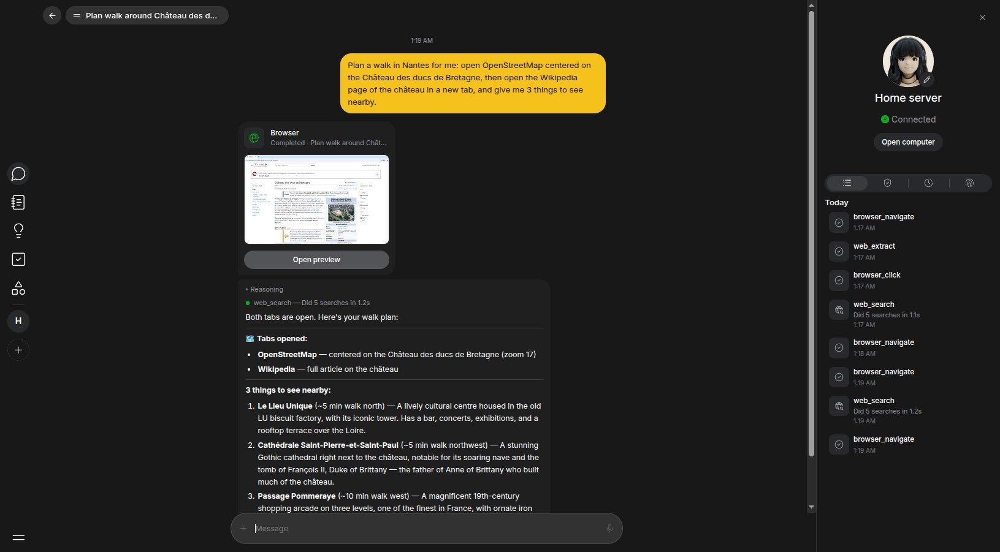
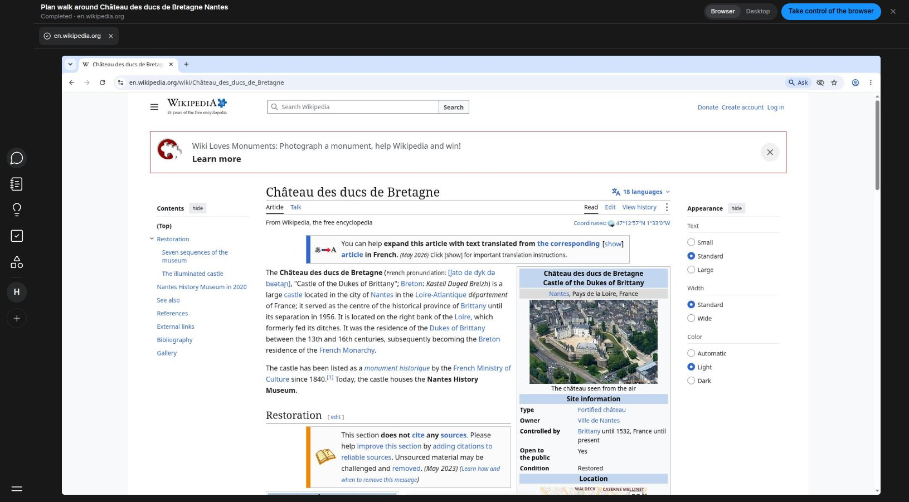
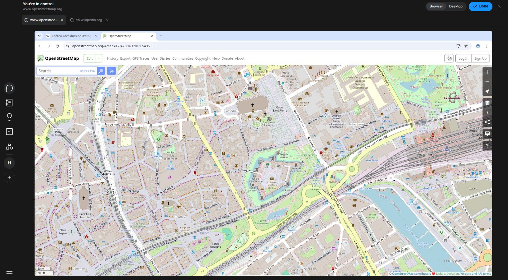
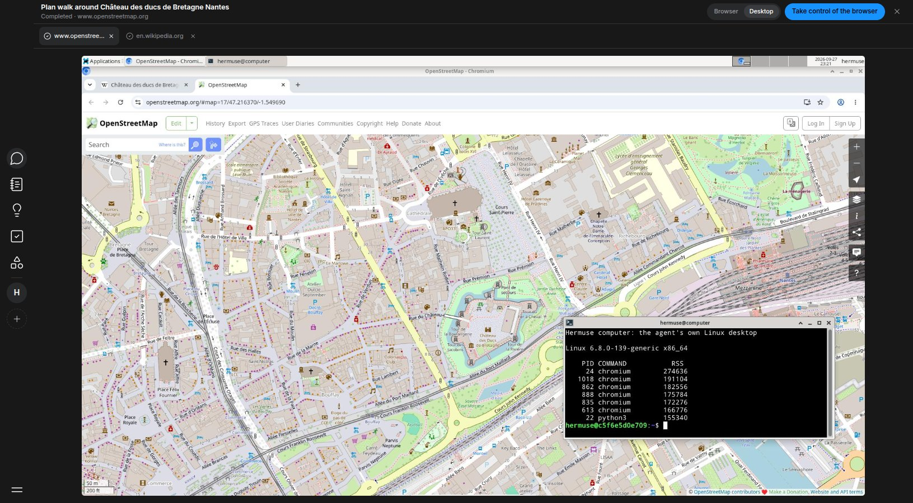

<p align="center">
  
</p>

<h1 align="center">Hermuse Agent</h1>

<p align="center">Your personal agent. It takes things off your plate.</p>

<p align="center">
  <a href="LICENSE"></a>
  
  
</p>

<p align="center"><a href="https://yellow-stick.com"><strong>yellow-stick.com</strong></a></p>

Ask in plain words. Hermuse gets to work in your calendar, your apps and on the
web, and checks with you before anything that matters.

<p align="center">
  
</p>

## How it works

1. **Ask.** Say what you need, the way you would tell a friend.
2. **It works on its own.** It searches, compares and gets things done. Each
   step shows up in Activity.
3. **You approve.** Before it books, buys or sends anything for you, it asks.
   Your answers live in Approvals.

## What's inside

- **Main chat and side chats.** One conversation that knows you, plus side
  chats to keep a trip, a move or a project apart.
- **Activity and Approvals.** A plain record of what it did and when, and
  nothing goes out without you.
- **Feed, Ideas, Goals, Library.** A daily feed written for you, ideas it can
  run, goals it keeps an eye on, and everything it made for you in one place.
- **Your models.** Connect the AI accounts and subscriptions you already have:
  the ones Hermes supports natively, plus Claude Pro/Max, ChatGPT, Meta, Kimi and
  more through a local bridge.
- **Its own computer, in plain sight.** The agent browses on its own Linux
  desktop, next to your Hermes. Watch it live, take the mouse and keyboard
  when it needs you, then hand them back.

## The agent's computer

When your agent uses the web, a **Browser** card shows up in its answer with a
live picture of its screen.

<p align="center">
  
</p>

Open it to watch the agent's browser, with one tab per window it opened.

<p align="center">
  
</p>

**Take control of the browser** gives you the mouse and keyboard, to log in
somewhere or accept a cookie banner. The agent waits until you click **Done**.

<p align="center">
  
</p>

Switch to **Desktop** to see its whole Linux desktop, terminal included.

<p align="center">
  
</p>

## Download

Hermuse Agent 0.1.0 for Linux is on the
[releases page](https://github.com/yellow-stick/hermuse-agent/releases), for
Ubuntu 22.04, 24.04 and 26.04 LTS, Debian 12 and 13 and their derivatives
(Pop!\_OS, Linux Mint), on x86_64 (amd64) only:

- `hermuse-agent_0.1.0-1_amd64.deb`: install it with
  `sudo apt install ./hermuse-agent_0.1.0-1_amd64.deb`;
- `Hermuse-Agent-0.1.0-linux-x86_64.AppImage`: mark it executable and open it,
  no FUSE needed.

On first launch it prepares what is missing (system packages, keyring, Docker,
Hermes Agent, the plugin and the agent's computer) after one administrator
authorization, with a network connection. Your model accounts and API keys
stay yours to connect. Check the files with `SHA256SUMS.txt` and the build
provenance with `gh attestation verify <file> --repo yellow-stick/hermuse-agent`.
Details: [Run Hermes on your computer with the desktop app](docs/guides/desktop.md).

## Get started

- [Set up Hermuse with Hermes on a server](docs/guides/server.md): install
  Hermes and Hermuse over SSH from the desktop app, or connect an existing
  server's dashboard.
- [Run Hermes on your computer with the desktop app](docs/guides/desktop.md).
- [Web app and relay](docs/guides/web-app-and-relay.md): serve the web app for
  your Hermes.
- [The agent's computer](docs/guides/agent-computer.md): the Browser card,
  the live viewer, Take control and the desktop.

## Inspired by Muse, built our own way

We are big fans of [Muse](https://muse.ai), Meta's personal AI agent. It showed
what an agent for everyone can feel like: one friendly conversation, an agent
that keeps working while you are away, and a clear record of what it did. A lot
of the Hermuse experience is inspired by it, and we say so openly.

Hermuse is our own proposal, built on different choices:

- **Open source.** Every line is public under the AGPL, so anyone can check
  what the agent does with your data, and improve it.
- **Your agent runs where you choose.** Hermuse drives your own
  [Hermes Agent](https://github.com/NousResearch/hermes-agent) instance, on
  your computer or your server, not a machine you cannot see.
- **Your data stays readable.** What the agent writes for you (feed, ideas,
  goals, library, reflections, preferences) is stored as Markdown and JSON
  files under `HERMES_HOME/hermuse/`. Open them, edit them, back them up or
  delete them with any tool.
- **Bring your own models.** Use the AI subscriptions you already pay for
  instead of a single built-in model.
- **Every screen, one codebase.** Web, macOS, Windows, Linux, iOS and Android
  from one Dart monorepo.

> Hermuse Agent is an independent project by Yellow Stick. It is not
> affiliated with, endorsed by or sponsored by Meta Platforms, Inc. or Nous
> Research. Muse is a trademark of Meta Platforms, Inc.; Hermes Agent is a
> project of Nous Research. Names are used only to describe inspiration and
> compatibility.

## Platforms

| Web | macOS | Windows | Linux | iOS | Android |
| :-: | :-: | :-: | :-: | :-: | :-: |
| Installable web app | Desktop app | Desktop app | Desktop app | Coming soon | Coming soon |

The desktop apps can install and supervise Hermes on your computer and add the
`hermuse` plugin to it. The web and mobile apps connect to a Hermes instance
you already run, for example on a server.

---

## Development

A Dart pub workspace (Melos 8.9) with two apps sharing the same state and
design tokens.

| Surface | Stack | Platforms |
| --- | --- | --- |
| `apps/hermuse_app` | Flutter 3.47 | iOS, Android, macOS, Windows, Linux |
| `apps/hermuse_web` | Jaspr 0.23 (static pre-render + `@client` hydration) | Web (real DOM, PWA) |

```
pubspec.yaml               pub workspace + Melos scripts
packages/
  yellow_stick_ui_core/    tokens + icons, the single source of truth
  yellow_stick_ui/         Flutter kit
  yellow_stick_ui_web/     Jaspr kit
  hermes_contract/         Hermes gateway JSON-RPC contract (generated from OpenRPC)
  hermes_client/           instances, secrets, dashboard REST + WebSocket transport
  cliproxy_client/         CLIProxyAPI management client (subscription bridge)
  hermuse_chat/            chat models, state and the Hermes-backed controller
  hermuse_data/            drift database (native file or WASM on the web)
  hermuse_state/           shared Riverpod state for both apps
  hermuse_host/            desktop only: Hermes install, supervision, bridge sidecar
apps/
  hermuse_app/             Flutter app
  hermuse_web/             Jaspr app
  hermuse_relay/           same-origin relay from the web app to Hermes instances
hermes-plugin/hermuse/     Hermes plugin: Feed, Ideas, Goals, Library, Reflections, the agent's computer
```

### Setup

```bash
dart pub global activate melos
flutter pub get          # resolves the whole workspace
melos run analyze
melos run test
```

### Running

```bash
cd apps/hermuse_app && flutter run -d linux     # or macos / windows / an iOS or Android device
tool/serve-web.sh                               # jaspr serve, http://localhost:8080 (per-worktree ports elsewhere)
cd apps/hermuse_web && jaspr build              # static output in build/jaspr
```

The desktop subscription bridge runs the CLIProxyAPI binary pinned in
`packages/hermuse_host/cliproxy.lock`. A development build verifies it in the
package tree: fetch it once for your platform (`linux-amd64`, `macos-arm64`,
…) and tell the app where that tree is. Release builds embed the binary and
its digest instead.

```bash
cd packages/hermuse_host && dart run tool/fetch_cliproxy.dart --platform linux-amd64 --frozen-lockfile
cd apps/hermuse_app && flutter run -d linux \
  --dart-define=HERMUSE_CLIPROXY_DEV_ROOT=$PWD/../../packages/hermuse_host
```

On Linux the app first prepares the computer (keyring, Hermes build tools,
Docker) with `packaging/linux/hermuse-linux-setup`. A release build embeds the
helper and its digest; a development build uses the checkout's copy only when
told where the checkout is, otherwise the preparation screen reports the
helper as unavailable:

```bash
cd apps/hermuse_app && flutter run -d linux \
  --dart-define=HERMUSE_WORKSPACE_ROOT=$(git rev-parse --show-toplevel) \
  --dart-define=HERMUSE_CLIPROXY_DEV_ROOT=$PWD/../../packages/hermuse_host
```

### Hermes plugin

`hermes-plugin/hermuse` adds the product layer to Hermes: six agent tools, the
background jobs (daily feed, weekly ideas, weekly goals check-in, nightly
reflection), a `hermes hermuse` CLI and a REST backend at
`/api/plugins/hermuse/`. Install and test instructions are in
[its README](hermes-plugin/hermuse/README.md). The desktop app bundles a copy;
refresh it with `dart run tool/sync_plugin_assets.dart` from `apps/hermuse_app`.

### Design system rule

> The token is the contract. The implementation is local.

The Flutter and Jaspr kits share no widget code. Both read the same values from
`yellow_stick_ui_core` — palette roles named after the Luna vocabulary used by
lynx-ui (`canvas`, `paper`, `content`, `primary`, `line`, …), type scale, radii,
spacing, shell breakpoints, icons, icon hover motions — and render them their
own way. Components are headless-first like lynx-ui: `YsPressable` exposes its
interaction state (pressed, hovered, focused, disabled) and styled variants sit
on top. Rail icons play a one-shot hover animation described once as keyframes
in `YsIconMotion`; the web kit compiles it to CSS `@keyframes`
(`YsMotionIconView`), the Flutter kit paints it (`YsMotionIcon`).

Behaviour is shared the same way: both apps render `hermuse_chat`'s `ChatState`
and call the same `ChatController`, so an action cannot behave differently on
the web and on native.

Chats follow a main/side model: each Hermes instance has one **Main chat**, and
every other thread is a **side chat** of it (created from Hermuse with the main
session as parent; pin, rename, archive, delete, full-text search). Other
sessions of the instance (CLI, Telegram, …) are not listed. The main chat and
the thread on screen are remembered per instance (`hermuse_state`).

### Web app (PWA)

`apps/hermuse_web` is an installable Progressive Web App:

- `web/manifest.webmanifest` — "Hermuse Agent", standalone, `#181819` theme,
  icons in `web/icons/` (192/512, maskable 512, Apple touch 180, SVG): the
  Hermuse mark, a yellow Bricolage Grotesque "h" on an ink `#15130A` tile
  (source: `docs/assets/hermuse-logo/` in yellow-stick/hermuse-website).
- `web/sw.js` — network-first service worker: online users always get the
  latest deploy, and everything fetched is cached so the app opens offline after
  one visit (the shell is precached at install). Bump `CACHE` in `sw.js` to drop
  old caches.
- iOS: `apple-mobile-web-app-*` metas and `apple-touch-icon`; opaque status bar
  because the layout does not handle safe-area insets yet.

Install from Chrome/Edge (install icon in the address bar) or Safari (Share →
Add to Home Screen). Service workers need HTTPS in production (localhost is
exempt).

### App icons

`packaging/icon/icon.svg` is the native app icon: the Hermuse mark on a 512
grid, a copy of `docs/assets/hermuse-logo/icon.svg` in
yellow-stick/hermuse-website. `packaging/icon/render-app-icons.sh` renders
every committed native icon from it (rsvg-convert and ImageMagick): Android
legacy and adaptive icons (vector foreground and monochrome layer), iOS
(opaque, full bleed), macOS (Apple's grid), Windows `app_icon.ico` and the
Linux window icon. The `.deb` and AppImage render their hicolor icons from the
same SVG when packaging. Run the script again after changing the icon:

```bash
packaging/icon/render-app-icons.sh
```

### Version notes

- `jaspr_builder` 0.23.5 requires `analyzer ^12`, which caps `build_runner` at
  2.15.1 and `build_web_compilers` at 4.8.5. Bump them together with Jaspr.
- `flutter_test` (Flutter 3.47.5) pins `test_api` 0.7.12, so pure Dart packages
  resolve `test` 1.31.x.

## Contributing

Issues and pull requests are welcome: see [CONTRIBUTING.md](CONTRIBUTING.md)
for the pull request flow, the checks each change goes through and how
releases are cut. Report vulnerabilities privately, as described in
[SECURITY.md](SECURITY.md).

## License

Hermuse Agent is licensed under the
[GNU Affero General Public License v3.0](LICENSE). If you run a modified
version as a service, you must share its source with its users.

**Commercial license.** Want to use Hermuse in a product or service without
the AGPL obligations? Contact us at
[contact@yellow-stick.com](mailto:contact@yellow-stick.com) for a commercial
license.

Third-party assets:

- Inter 4.1 (SIL Open Font License 1.1), bundled in `yellow_stick_ui/fonts` and
  `apps/hermuse_web/web/fonts`.
- Icons adapted from Lucide (ISC License).
- The Hermuse avatar is original artwork; airline logos are rendered as monogram
  discs rather than brand artwork.

<p align="center"><sub>Built by <a href="https://yellow-stick.com">Yellow Stick</a> · Free your imagination.</sub></p>
