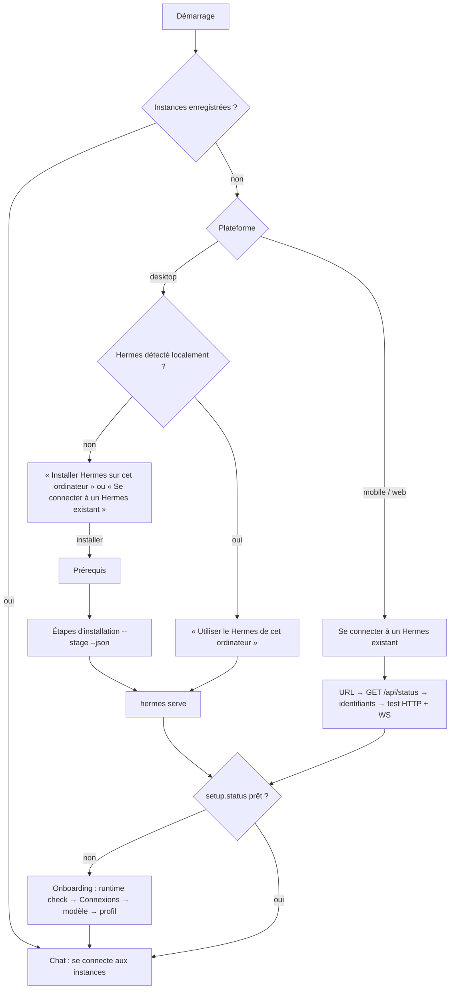

# Hermuse × Hermes Agent — plan d'architecture

Hermuse n'a pas de back-end propre : **chaque back-end est une instance Hermes Agent**
(Nous Research). Hermuse est une UI multi-plateforme (Flutter natif + Jaspr web) qui se
connecte à **N instances** dès le premier jour. Sur desktop, Hermuse peut aussi installer
et piloter une instance locale.

Référence de version : Hermes Agent **v0.21.5** (installée localement et sur le VPS
Contabo). Source lue : `~/.hermes/hermes-agent`.

## 1. Constat

| Fait | Source |
| --- | --- |
| Hermes Desktop officiel, Conduit iOS et Hermes-Relay parlent au **dashboard** (`hermes serve` / `hermes dashboard`, port 9119) : REST `/api/*` + WebSocket `/api/ws` en JSON-RPC (« TUI gateway »). | `apps/desktop/electron/*`, `tui_gateway/ws.py` |
| Le contrat JSON-RPC est **généré** : `apps/shared/src/gateway-contract.openrpc.json` (OpenRPC 1.3.2, 237 méthodes + `x-server-requests` + `x-notifications`), produit par `scripts/gen_gateway_contracts.py` depuis les modèles Pydantic de `tui_gateway/contracts/`. | `tui_gateway/contracts/base.py` |
| Le second protocole, l'API server OpenAI-compatible (`hermes gateway`, port 8642, `/v1/runs` + SSE, clé Bearer, CORS configurable), sert Open WebUI, Conduit Flutter (cogwheel0) et Hermes Console. | `gateway/platforms/api_server*.py` |
| CORS du dashboard **codé en dur** sur `localhost|127.0.0.1` ; `dashboard.public_url` est la seule origine Host/Origin de confiance hors loopback. | `hermes_cli/web_server.py:399-405`, `:1113` |
| Auth dashboard hors loopback : `basic` (mot de passe → cookie de session HMAC, 12 h), `nous` (OAuth Portal), `self_hosted` (OIDC). WebSocket : ticket à usage unique `POST /api/auth/ws-ticket`. Clients natifs : `/auth/native/{authorize,token,refresh}` (PKCE, tokens Bearer). En loopback : `HERMES_DASHBOARD_SESSION_TOKEN` / en-tête `X-Hermes-Session-Token`. | `hermes_cli/dashboard_auth/routes.py` |
| `hermes serve --port 0` choisit un port libre et annonce `HERMES_BACKEND_READY port=<n>` ; port occupé → exit 75. | `hermes_cli/subcommands/dashboard.py` |
| Installateur officiel **par étapes, pilotable par machine** : `install.sh --manifest` → JSON `{protocol_version:1, stages:[{name,title,category,needs_user_input}]}` (`prerequisites, repository, venv, python-deps, node-deps, path, config, setup, gateway, complete` + `desktop` optionnel) ; `install.sh --stage <nom> --non-interactive --json` → dernière ligne `{ok,stage,skipped[,reason]}`. `install.ps1` : même protocole, 15 étapes (uv, git, node, system-packages, repository, python, venv, dependencies, node-deps, desktop, path, config-templates, platform-sdks, bootstrap-marker, configure, gateway). Il installe uv, **Python géré par uv** (`requires-python >=3.11,<3.14`, 3.11.14 chez toi), le venv + extras verrouillés, Node, Chromium (Playwright), browser-use, cua-driver, lanceurs `hermes`/`hermes-agent`/`hermes-acp`. `sudo` uniquement pour des libs système optionnelles. Hermes Desktop pilote déjà ce protocole (`apps/desktop/electron/bootstrap-runner.ts`). | `scripts/install.sh:360-383`, `scripts/install.ps1` |
| Onboarding Hermes **exposé en API** : RPC `setup.status`, `setup.runtime_check`, `setup.ready`, `model.options`, `model.save_key`, `config.get/set`, `free_tier.status/provision/ack_notice`, `onboarding.ensure_setup_profile` ; REST dashboard `/api/model/options`, `/api/model/set`, `PUT /api/env`, `POST /api/providers/validate`, `/api/providers/custom-endpoints`, `/api/credentials/pool`, et OAuth fournisseurs `GET /api/providers/oauth`, `POST …/{id}/start`, `GET …/{id}/poll/{session}`, `DELETE …/{id}`. | `apps/shared/src/gateway-contract.openrpc.json`, `hermes_cli/web_routers/oauth.py:619-775` |
| Comptes LLM natifs de Hermes : Nous Portal (device code + free tier), OpenAI Codex/ChatGPT (device code), xAI, Copilot, MiniMax (device code), OpenRouter, clés API (25+), `custom` = tout endpoint OpenAI-compatible (`model.base_url`). Anthropic abonnement et Qwen = flux **externes** (CLI à lancer à la main, refusé par `/start`). **Pas d'abonnement Meta.** | `hermes_cli/auth.py`, `web_routers/oauth.py:729` |
| **CLIProxyAPI** (router-for-me, **MIT**, Go, binaire unique, **v7.3.18 du 2026-09-26**) : connecte des abonnements et les ré-expose en API OpenAI/Anthropic/Gemini sur `:8317`. API de gestion pensée pour les GUI : `GET /v0/management/{anthropic,codex,meta,antigravity,xai,kimi,kimi-ai,devin}-auth-url` → `{url,state}` puis `GET /v0/management/get-auth-status?state=` ; `meta` = abonnement **Meta** (depuis v7.3.4). Auth : `X-Management-Key`. Tokens dans `auth-dir`. | `internal/api/server_management.go:197`, doc management |
| **omp** (MIT, TS/Bun) : mêmes connecteurs (dont Meta), exposés via `omp auth-gateway serve` (OpenAI-compatible, `127.0.0.1:4000`) adossé à un auth-broker. Login uniquement en CLI (`omp login`, `omp auth-broker login`), pas d'API REST pour démarrer un OAuth ; binaire 265 Mo. Ton omp est en mode broker vers le VPS (`:8766`, tailnet). | `docs/auth-broker-gateway.md` (upstream) |
| VPS Contabo : `hermes-dashboard` (user `admin`, `127.0.0.1:9119`) exposé par Tailscale Funnel sur `https://vmi3607390.tailc1c2ea.ts.net`, auth `basic` (mot de passe tourné le 2026-09-26, 1Password « Hermes dashboard Contabo »). Pas d'API server actif. | inspection VPS |
| Prior art Dart local : BevyFlow `lib/generation/provisioning/uv_provider.dart` (uv épinglé + sha256, 5 OS), `backend/comfyui_process.dart` (venv → `Process.start` → sonde de disponibilité), `backend/comfyui_backend.dart` (HTTP + WS). | `/home/remy/code/bevyflow` |
| Hermuse aujourd'hui : `hermuse_chat` = état + contrôleur **mockés** (`seed.dart`), aucun réseau. | ce repo |

## 2. Décisions

1. **Transport principal : dashboard `/api/ws` JSON-RPC.** C'est le protocole le plus riche
   (sessions, historique, slash commands, approbations, clarify, profils, sous-agents),
   celui de Desktop et Conduit, et celui que ton VPS expose déjà. L'API server reste un
   second transport optionnel derrière la même interface, pas un chantier v1.
2. **Contrat généré, pas écrit à la main.** Un générateur Dart lit
   `gateway-contract.openrpc.json` et produit les types de params/résultats/événements.
   Un bump de Hermes = régénérer + corriger la compilation.
3. **Multi-instance natif.** Toute donnée conversationnelle est adressée par
   `(instanceId, sessionId)`. Pas d'« instance courante » globale dans le domaine.
4. **Install locale = installateur officiel piloté par Dart.** Pas d'uv/Python maison : le
   script officiel les installe déjà en version épinglée. Dart détecte, lance, suit la
   progression, puis supervise `hermes serve`. Une install existante gagne toujours.
5. **Aucune instance codée en dur.** Comme Conduit, l'utilisateur saisit dans Hermuse
   l'URL de son Hermes et ses identifiants ; Hermuse ne connaît aucun serveur par défaut.
   Le VPS Contabo n'est qu'une instance de test ajoutée par ce formulaire.
6. **Les secrets ne quittent jamais le stockage sécurisé** : Keychain/Keystore/libsecret/
   DPAPI via `flutter_secure_storage` ; jamais en base ni en état Riverpod persisté.
7. **Installation locale étape par étape** avec le protocole `--manifest`/`--stage --json`
   de l'installateur officiel, comme Hermes Desktop. Les étapes interactives (`setup`,
   `gateway`) sont sautées et remplacées par l'onboarding dans Hermuse.
8. **Connexions de comptes à deux niveaux** : d'abord les fournisseurs natifs de Hermes
   (via son API, marche aussi pour une instance distante) ; ensuite, pour les abonnements
   qu'il ne gère pas (Claude Pro/Max, Meta, Antigravity, Kimi…), un **pont
   CLIProxyAPI** déclaré dans Hermes comme endpoint `custom`. CLIProxyAPI plutôt qu'omp :
   API REST de login pensée pour une GUI, binaire Go unique, MIT, couvre Meta.
   omp reste possible comme carte « endpoint personnalisé ». Sur desktop, CLIProxyAPI est
   **embarqué dans l'app** (binaire sidecar), pas téléchargé à la demande.
9. **Pile Dart** : drift (SQLite, WASM sur le web) + `flutter_secure_storage` + Riverpod 3
   (générateur) partagé en Dart pur, consommé par `flutter_riverpod` et `jaspr_riverpod`.

## 3. Packages

```
packages/
  hermes_contract/      pure Dart, GÉNÉRÉ — types OpenRPC (params, results, events, server requests)
  hermes_client/        pure Dart, web + io — instances, auth, transport JSON-RPC, REST dashboard
  cliproxy_client/      pure Dart — client de l'API de gestion CLIProxyAPI (login, comptes, modèles)
  hermuse_data/         pure Dart — base drift (instances, sessions/messages en cache, FTS5, réglages)
  hermuse_state/        pure Dart — providers Riverpod (instances, connexions, onboarding, comptes, chat)
  hermuse_host/         Dart io (desktop) — détection, installation et supervision de Hermes + CLIProxyAPI
  hermuse_chat/         pure Dart — modèles de chat et mapping événements Hermes → blocs UI
tool/
  gen_hermes_contract.dart   OpenRPC → packages/hermes_contract/lib/src/*.g.dart
```

Dépendances : `hermes_contract` ← `hermes_client` ; `hermes_client`, `cliproxy_client`,
`hermuse_data`, `hermuse_chat` ← `hermuse_state` ← apps. `hermuse_host` ← `hermuse_app`
seulement (jamais importé par le web ni le mobile).

### 3.1 `hermes_contract` (généré)

- Entrée : `gateway-contract.openrpc.json` copié dans `packages/hermes_contract/contract/`
  avec la version Hermes source (`contract/VERSION`, ex. `0.21.5 130b8f2c`).
- Sortie : classes immuables `fromJson`/`toJson` pour chaque `params`/`result`, enums
  pour les `StrEnum`, unions scellées pour les discriminants `Literal`, une table
  `HermesMethods` (nom → types) et une union scellée `HermesEvent` pour `x-notifications`,
  `HermesServerRequest` pour `x-server-requests`.
- Params générés stricts (le serveur répond `4000` aux clés inconnues) ; résultats tolérants.
- Test : régénération en mémoire == fichiers committés.

### 3.2 `hermes_client`

```dart
/// Une instance Hermes enregistrée. Aucune donnée secrète ici.
final class HermesInstance {
  final String id;            // UUID v4, identité stable
  final String label;         // unique, ≤ 64 caractères
  final InstanceKind kind;    // local | remote   (ssh plus tard)
  final Uri baseUrl;          // http://127.0.0.1:<port> ou https://host[/prefix]
  final AuthMethod auth;      // loopbackToken | password | nativeOAuth
  final String? profile;      // profil Hermes ciblé, null = défaut
}

abstract interface class InstanceStore {      // métadonnées (non secrètes)
  Future<List<HermesInstance>> load();
  Future<void> save(List<HermesInstance> instances);
}
abstract interface class SecretStore {        // un enregistrement par instance id
  Future<String?> read(String instanceId, String key);
  Future<void> write(String instanceId, String key, String value);
  Future<void> delete(String instanceId);
}

abstract interface class HermesTransport {    // un par instance connectée
  Stream<ConnectionState> get state;
  Stream<HermesEvent> get events;             // notifications typées
  Future<R> call<P, R>(HermesMethod<P, R> method, P params);
  void onServerRequest(ServerRequestHandler handler); // approval, clarify, secret…
  Future<void> close();
}
```

- **`HermesRegistry`** : CRUD des instances, dédoublonnage (URL normalisée : trim,
  minuscules, sans `/` final), une instance « primaire » facultative.
- **`HermesConnections`** : connexions paresseuses (ouvertes à la première vue qui en a
  besoin), reconnexion avec backoff, fermeture à l'inactivité. Sonde publique
  `GET /api/status` (version, `auth_required`, `auth_providers`) avant toute auth.
- **`DashboardTransport`** (implémentation v1) :
  1. Auth selon `AuthMethod` :
     - `loopbackToken` → en-tête `X-Hermes-Session-Token` ;
     - `password` → `POST /auth/password-login {provider:"basic",username,password}` →
       cookie de session conservé par le client HTTP (natif) ou le navigateur (web) ;
     - `nativeOAuth` → `/auth/native/authorize` (PKCE S256, redirection loopback desktop /
       deep link mobile) → `/auth/native/token`, refresh via `/auth/native/refresh`.
  2. `POST /api/auth/ws-ticket` → ouverture `wss://…/api/ws?ticket=…`.
  3. Attendre `gateway.ready`, puis **obligatoirement** `client.capabilities
     {server_requests: true}` (sinon toutes les requêtes serveur → client sont refusées).
  4. JSON-RPC ligne par ligne ; corrélation par `id` ; les requêtes serveur (`approval`,
     `clarify`, `sudo`, `secret`, …) sont routées vers le handler et répondues avec le même `id`.
- HTTP/WS : `package:http` + `package:web_socket` (fonctionnent sur io et web).
- **`ApiServerTransport`** (plus tard, même interface) : `/v1/runs` + SSE, Bearer.

### 3.3 `hermuse_host` (desktop) — installer et faire tourner Hermes en local

Tout se passe **sans sudo, dans le dossier utilisateur**, par l'installateur officiel.

1. **Détection** : `~/.local/bin/hermes` (POSIX) / `%LOCALAPPDATA%\hermes` (Windows),
   `HERMES_HOME`, `hermes --version`. Install existante → on l'utilise, jamais de doublon.
2. **Prérequis** que l'installateur ne fournit pas : `git`, `curl`, `tar` (Linux/macOS).
   macOS sans git → déclencher `xcode-select --install` et attendre. Windows : `install.ps1`
   installe git lui-même. Absents → écran d'explication avec la commande exacte.
3. **Script** : téléchargé une fois (`https://hermes-agent.nousresearch.com/install.sh` /
   `install.ps1`) dans le cache de l'app, empreinte SHA-256 journalisée.
4. **Plan** : `install.sh --manifest` → liste des étapes affichée telle quelle
   (titre, catégorie) dans l'écran de progression.
5. **Exécution** : pour chaque étape sans `needs_user_input`,
   `install.sh --stage <nom> --non-interactive --json [--skip-browser]` ; stdout/stderr
   streamés dans un panneau « détails », la dernière ligne JSON `{ok,stage,skipped,reason}`
   fait avancer la barre. Échec → message + `reason` + bouton « Réessayer cette étape »
   (les étapes sont idempotentes). Windows : `powershell -ExecutionPolicy Bypass -File
   install.ps1 -Stage <nom> -NonInteractive -Json`.
   Ce que ça installe : uv → **Python géré par uv** (3.11–3.13) → venv + dépendances
   Python verrouillées → Node + deps npm → Chromium (option « outils navigateur », ~Go) →
   lanceur `hermes` + PATH → config et skills par défaut.
6. **Étapes interactives** (`setup`, `gateway`) : sautées, remplacées par l'onboarding in-app (§ 3.6).
7. **Supervision** : `hermes serve --host 127.0.0.1 --port 0` avec un
   `HERMES_DASHBOARD_SESSION_TOKEN` aléatoire (mémoire seulement), lecture de
   `HERMES_BACKEND_READY port=<n>`, instance `local` créée/actualisée, redémarrage sur crash
   avec backoff, arrêt à la fermeture. Jamais de `kill` d'un processus non lancé par Hermuse
   (cohabitation avec Hermes Desktop).
8. **Mises à jour** : `hermes update` déclenché depuis l'écran instance ; version affichée
   via `/api/status`, alerte si hors plage de contrat testée.
9. **CLIProxyAPI embarqué** (§ 3.5) :
   - **Bundle** : le binaire de la release épinglée (≈ 21–23 Mo compressé par cible :
     `linux_{amd64,aarch64}`, `darwin_{amd64,aarch64}`, `windows_{amd64,aarch64}`) est
     téléchargé au build, vérifié contre `checksums.txt`, et placé dans le bundle :
     `Contents/MacOS/` (signé + notarisé avec l'app, entitlement hardened runtime),
     à côté de l'exe Windows (signé), `lib/` du bundle Linux. Licence MIT incluse dans
     l'écran « Licences ». Un script `tool/fetch_cliproxy.dart` + version dans
     `hermuse_host/cliproxy.lock` (version + sommes) rend le build reproductible.
   - **Démarrage paresseux** : lancé seulement quand au moins une carte « pont » est
     connectée (ou pendant un login), arrêté sinon.
   - **Config** : `config.yaml` généré dans le support dir (bind `127.0.0.1` port libre,
     `auth-dir` privé 0700, clé de gestion + clé API aléatoires dans le `SecretStore`),
     jamais de `allow-remote`.
   - **Mise à jour hors cycle** : les fournisseurs cassent ces intégrations souvent. L'app
     peut remplacer le binaire embarqué par une release plus récente (vérifiée contre
     `checksums.txt` et une liste de versions autorisées publiée par Yellow Stick),
     stockée dans le support dir ; retour au binaire embarqué si elle ne démarre pas.
   - Même supervision que Hermes (readiness sur l'API de gestion, redémarrage, arrêt propre).

Référence d'implémentation : `apps/desktop/electron/bootstrap-runner.ts` (Hermes Desktop)
pour les étapes, BevyFlow `comfyui_process.dart` pour le process + readiness en Dart.

### 3.5 Page « Connexions » (cartes de comptes)

Une grille de cartes, une par fournisseur, **par instance Hermes** (les comptes vivent là
où tourne Hermes). Chaque carte : logo, état (non connecté / connecté en tant que … /
expiré / erreur), bouton Connecter / Déconnecter, modèles disponibles.

| Carte | Chemin | Flux dans l'UI |
| --- | --- | --- |
| Nous Portal (dont offre gratuite), ChatGPT/Codex, xAI Grok, GitHub Copilot, MiniMax | natif Hermes | `POST /api/providers/oauth/{id}/start` → afficher code + URL (device code) → `poll` jusqu'à OK |
| OpenRouter, OpenAI, Anthropic API, Gemini API, DeepSeek… (clés) | natif Hermes | champ clé → `POST /api/providers/validate` → `model.save_key` / `PUT /api/env` |
| Claude Pro/Max, **Meta**, Gemini Antigravity, Kimi, Devin | pont CLIProxyAPI | `GET /v0/management/{anthropic,meta,antigravity,kimi,devin}-auth-url` → ouvrir `url` (ou afficher le code device) → `get-auth-status?state=` → une fois un compte actif, enregistrer CLIProxyAPI dans Hermes via `/api/providers/custom-endpoints` (`base_url http://127.0.0.1:8317/v1`, clé API) |
| Endpoint personnalisé (omp auth-gateway, Ollama, LM Studio, vLLM…) | natif Hermes `custom` | URL + clé → validation → `custom-endpoints` |

- Liste et état des cartes : `GET /api/providers/oauth` + `/api/credentials/pool` (Hermes),
  `GET /v0/management/auth-files` (CLIProxyAPI).
- Choix du modèle par défaut : `/api/model/options` → `/api/model/set`.
- **Instance distante** : les cartes natives marchent telles quelles (Hermes fait l'OAuth
  côté serveur). Les cartes « pont » exigent CLIProxyAPI sur la même machine que Hermes :
  le plugin Hermuse l'installe et le fait tourner à côté de lui
  (`hermes-plugin/hermuse/subscription_bridge.py`, même version épinglée et mêmes sommes
  que `cliproxy.lock`, Linux x86-64/ARM64, sans root). La connexion se fait sur ce
  CLIProxyAPI du serveur (`POST /api/plugins/hermuse/bridge/login`), rien ne tourne sur
  l'appareil de l'utilisateur. Le navigateur finit une connexion OAuth sur une adresse
  `http://localhost:<port>/…` qui n'atteint pas le serveur : l'utilisateur la colle dans
  l'app, qui l'envoie à `POST …/bridge/login/callback` ; CLIProxyAPI en lit `state` et
  `code`. L'app enregistre ensuite l'endpoint Hermes sur `http://127.0.0.1:<port>/v1` du
  serveur. Le web et le mobile ont donc les mêmes cartes pont que le bureau.
- Les cartes sont décrites par des données (id, nom, logo, chemin, flux), pas codées écran
  par écran : ajouter un fournisseur = une entrée.

### 3.6 Onboarding Hermes dans Hermuse

Remplace le wizard `hermes setup`, sur toute instance (locale ou distante) dont
`setup.status` dit qu'elle n'est pas prête :

1. `setup.runtime_check` → problèmes d'environnement affichés avec leur correction.
2. **Cerveau** : page Connexions filtrée sur les fournisseurs de modèles, avec en
   raccourci l'offre gratuite Nous (`free_tier.status` → `free_tier.provision` →
   `free_tier.ack_notice`).
3. **Modèle par défaut** : `model.options` → sélection → `/api/model/set`.
4. **Profil** : `onboarding.ensure_setup_profile` → conversation « fais connaissance »
   (c'est la promesse Hermuse : l'agent apprend qui tu es).
5. `setup.ready` → chat.

Messageries (Telegram, WhatsApp…), mémoire, outils : écrans Réglages plus tard, mêmes API
(`config.get/set`, `/api/messaging/platforms/*`).

### 3.7 Données et état

| Besoin | Choix | Version (2026-09) |
| --- | --- | --- |
| Base locale | **drift** + `sqlite3` ; fichier natif sur Flutter, `WasmDatabase` (OPFS → IndexedDB) sur Jaspr ; requêtes `watch()` réactives ; migrations générées ; **FTS5** pour chercher dans les messages hors ligne | drift 2.35.0, drift_dev 2.35.0, sqlite3 3.6.0 |
| Secrets | **`flutter_secure_storage`** derrière `SecretStore` (Keychain, Keystore, libsecret, stockage protégé Windows) ; trousseau Linux verrouillé/absent → erreur explicite | 11.2.0 |
| État | **Riverpod 3** + `riverpod_generator` ; providers en Dart pur dans `hermuse_state`, consommés par `flutter_riverpod` et `jaspr_riverpod` (compatible jaspr ^0.23) | riverpod 3.4.3, riverpod_generator 4.0.9, jaspr_riverpod 0.4.6 |

Tables drift : `instances` (métadonnées), `sessions` et `messages` (cache par
`(instanceId, sessionId)`, FTS5), `settings`. Les streams drift alimentent des
`StreamProvider` ; pas de `persist()` expérimental de Riverpod. Écartés : Realm (fin de
vie), ObjectBox (pas de web), Isar Community (web limité), Hive CE/sembast (ni migrations
ni FTS).

### 3.8 `hermuse_chat` + `hermuse_state`

- Le `ChatController` actuel devient des notifiers Riverpod dans `hermuse_state`, qui
  lisent `HermesConnections` + `HermesRegistry` au lieu du seed.
- `ThreadRef = (instanceId, sessionId)`. La barre latérale = union des `session.list` de
  toutes les instances connectées, badge d'instance par fil.
- Envoi : `session.create` / `session.resume` puis `prompt.submit`.
- Réception : `message.delta` → texte en streaming, `message.complete` → message final,
  `tool.start`/`tool.complete` → lignes d'activité, `reasoning.delta` → bloc réflexion repliable.
- Requête serveur `approval` → bloc de choix réutilisant `ChoiceBlock` (`once`,
  `session`, `always`, `deny`) ; `clarify` → question + réponse libre.
- Interrompre : `session.interrupt`. Historique : `session.history`.
- Les blocs de démo (vols, offres) et `seed.dart` sortent du chemin de production : ils
  deviennent un `FakeHermesTransport` utilisé par les tests et les rendus de design.

## 4. Parcours UI



Écrans à ajouter aux deux kits (Flutter + Jaspr, mêmes tokens `yellow_stick_ui_core`) :
bienvenue/choix, prérequis, progression d'installation (desktop), ajout d'instance,
onboarding, **Connexions** (grille de cartes + flux device code / navigateur), liste des
instances (renommer, primaire, supprimer, état, mise à jour), sélecteur d'instance dans le
rail, bannière hors ligne, blocs approbation et clarify.

## 5. Stockage par plateforme

| Plateforme | Métadonnées + cache | Secrets |
| --- | --- | --- |
| iOS / Android / macOS / Windows / Linux | drift, fichier SQLite dans le support dir | `flutter_secure_storage` ; sans trousseau Linux → refus explicite, pas de clair silencieux |
| Web | drift WASM (OPFS / IndexedDB) | selon la solution du § 6 ; jamais de mot de passe dans le navigateur |

## 6. Le web

Sur natif (comme Conduit), l'app appelle l'URL saisie directement : pas de CORS.
Dans un navigateur, c'est bloqué : le dashboard n'accepte que les origines loopback +
`dashboard.public_url` (CORS codé en dur `web_server.py:399`, garde Origin sur la WS).
Une page servie depuis le domaine Hermuse ne peut donc pas parler au dashboard d'une URL
saisie par l'utilisateur. Options, même formulaire URL + mot de passe côté utilisateur :

- **A — Relais Hermuse** : le serveur du site web Hermuse relaie HTTP + WS vers l'URL
  saisie (appel serveur à serveur, pas de CORS). Marche avec n'importe quel Hermes sans
  toucher l'instance, mais le trafic et la session passent par notre serveur.
- **B — API server** : le propriétaire de l'instance active `API_SERVER_ENABLED` et met
  l'origine Hermuse dans `API_SERVER_CORS_ORIGINS` ; l'utilisateur saisit URL + clé API.
  Direct navigateur → Hermes, mais configuration serveur obligatoire et protocole moins riche.
- **C — Web servi par l'instance** (`/app/` sur le même domaine) : aucun secret en JS,
  mais pas de formulaire URL, une install par instance.

Décision à prendre avant la phase 8 ; l'interface `HermesTransport` absorbe les trois.

## 7. Phases

| # | Livrable | Acceptation |
| --- | --- | --- |
| 1 | Socle : `hermes_contract` généré, `hermuse_data` (drift + migrations), `SecretStore`, `hermuse_state` (Riverpod) branché dans Flutter et Jaspr | Génération OpenRPC v0.21.5 compile + test de non-dérive ; base ouverte sur Linux, Android et navigateur (WASM) ; une instance factice lue via un provider dans les deux apps. |
| 2 | `hermes_client` : registre, `DashboardTransport` (loopback + password), REST dashboard | Test d'intégration paramétré (URL + identifiants en variables d'environnement, rien dans le code) : connexion, liste des sessions, prompt, streaming + un `tool.start`. |
| 3 | Chat branché, `FakeHermesTransport` pour les tests | Tests rejouant des trames capturées sur v0.21.5 (delta, complete, approval, interrupt, reconnexion). Seed retiré du chemin prod. |
| 4 | App Flutter : bienvenue, « Ajouter un Hermes » (URL + identifiants, test avant enregistrement), liste d'instances, approbations | Sur Linux puis Android : saisir une URL + mot de passe, discuter, approuver une commande ; relance → reconnexion sans ressaisie ; mauvais mot de passe → erreur claire. |
| 5 | Onboarding + page Connexions (cartes natives Hermes) | Sur une instance neuve : runtime check, connexion ChatGPT/Codex ou Nous par device code, clé OpenRouter validée, modèle par défaut choisi, conversation de profil, puis chat. |
| 6 | `hermuse_host` : prérequis, install par étapes, supervision | VM Linux vierge (puis macOS, puis Windows) : installer depuis l'app avec progression par étape, erreur simulée → « Réessayer » reprend l'étape ; instance `local` créée ; machine avec Hermes → détecté, pas de réinstallation. |
| 7 | Pont CLIProxyAPI + cartes abonnements | Desktop : connecter Meta et Claude Pro/Max depuis leurs cartes, CLIProxyAPI enregistré dans Hermes, un modèle Meta sélectionnable et répond dans le chat. |
| 8 | Web (option A, B ou C du § 6) | Depuis un navigateur : ajouter une instance, login, chat, approbation ; aucun secret dans le stockage du navigateur. |
| 9 | Multi-instance complet | VPS + locale : fils des deux dans la barre latérale, envoi vers la bonne instance, l'une hors ligne n'affecte pas l'autre. |
| 10 | Couche produit : plugin Hermes `hermuse` (Feed, Ideas, Goals suivis, Library, Reflections, préférences proactives dans `PREFERENCES.md`) + écrans correspondants — voir `hermes-plugin/hermuse/README.md` | Plugin installé depuis Hermuse sur une instance ; l'agent publie un post de feed, propose une idée, suit un goal avec timeline, range un artifact ; reflection nocturne écrite ; tout visible dans Hermuse. |
| 11 | Optionnel : `nativeOAuth` (Nous Portal / OIDC), `ApiServerTransport`, SSH façon Desktop, CLIProxyAPI sur instance distante, messageries | Au besoin. |

## 8. Risques

- **Dérive du protocole** : `/api/ws` est interne à Hermes et évolue vite. Parade : contrat
  généré + version annoncée par `/api/status` ; refuser proprement une version hors plage testée.
- **Web** : aucune option n'est gratuite (relais à héberger, config serveur, ou install par
  instance). À trancher avant la phase 8.
- **Conditions d'utilisation des abonnements** : utiliser un abonnement Claude Pro/Max,
  ChatGPT ou Meta hors de leurs clients officiels (ce que font CLIProxyAPI et omp, en
  imitant leurs en-têtes) peut enfreindre les CGU des fournisseurs et casser à chaque
  changement de leur côté. Acceptable pour un usage personnel ; pour un produit public, ces
  cartes doivent être présentées comme « avancé, à vos risques » ou retirées.
- **Taille de l'install** : Chromium + Node + venv pèsent plusieurs Go ; l'option
  « outils navigateur » est décochable (`--skip-browser`).
- **Deux superviseurs** (Hermes + CLIProxyAPI) sur desktop : même code de supervision,
  ports éphémères/loopback, arrêt propre.
- **Funnel public + auth `basic`** : le mot de passe est la seule barrière. Le passer à OIDC ou
  Nous OAuth avant d'ouvrir à d'autres utilisateurs.
- **Install Windows** : `install.ps1` natif récent ; prévoir WSL2 en repli.
- **Infra VPS** : `tailscale funnel` n'a pas de service de relance après reboot (constaté le 2026-09-24).
